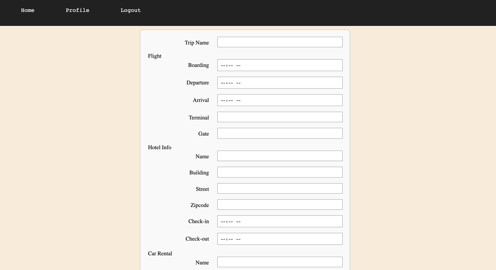
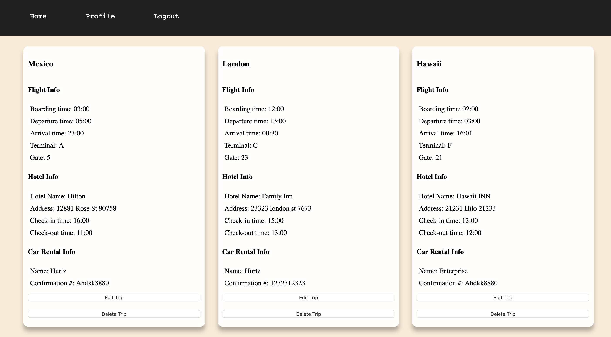

# Trip Logger

<h2>DESCRIPTION</h2> 
I love to travel, but one of my least favorite aspects of traveling is keeping track of all my trip information. Such as the hotel, flight and car rental information. Trip Logger is a useful application that allows the user to store, edit and delete trip information.

No more needing to check various emails.

<h2>FUNCTIONALITY</h2>

This app's functionality includes:

<ul>
	<li>Access to demo accounts to try the app out before signing up</li>
	<li>Register as a user</li>
	<li>Login as an exciting user</li>
	<li>Ability to add new trips</li>
  <li>Ability to edit exciting trips</li>
	<li>Ability to delete trips</li>
	<li>Users may visit their profile page to view all exciting trips</li>
</ul>

<H2>APPLICATION WEBSITE</h2>

 May preview a working prototype at [Trip Logger Demo](https://protected-basin-48207.herokuapp.com/index.html)

### Landing Page

### User Login

### User Registration Page

### User's Home Page

### Trip Form

### User's Profile Page

<h2>SECURITY</h2>
<ul>
	<li>Application uses JWT authentication </li>
	<li>Passwords are encrypted using bcrypt.js</li>
</ul>

<h2>TECHNOLOGY</h2>
<h3>Front End</h3>
<ul>
	<li>HTML</li>
	<li>CSS</li>
	<li>JavaScript</li>
	<li>jQuery</li>
	<li>AJAX JSON calls to the app's API</li>
</ul>

<h3>Back End</h3>
<ul>
	<li>Node.js</li>
	<li>Express</li>
	<li>Mocha</li>
	<li>Chai</li>
	<li>MongoDB</li>
	<li>Mongoose</li>
	<li>bcryptjs</li>
	<li>Passport</li>
</ul>

<h2>API Documentation</h2>

API endpoints for the back end include:

<ul>Users
	<li>POST to '/api/auth' to create a new users</li>
	<li>POST to '/api/users' sign in exciting user</li>
</ul>

<ul>Trips
	<li>GET to '/api/trips' to view all existing trips</li>
	<li>GET to '/api/trips/:id' to view a single trip by ID</li>
	<li>POST to '/api/trips' to create new trip entry</li>
	<li>PUT to '/api/trips/:id' to edit an exciting trip by ID</li>
  <li>DELETE to '/api/trips/:id' to delete a single trip by ID/li>
</ul>

